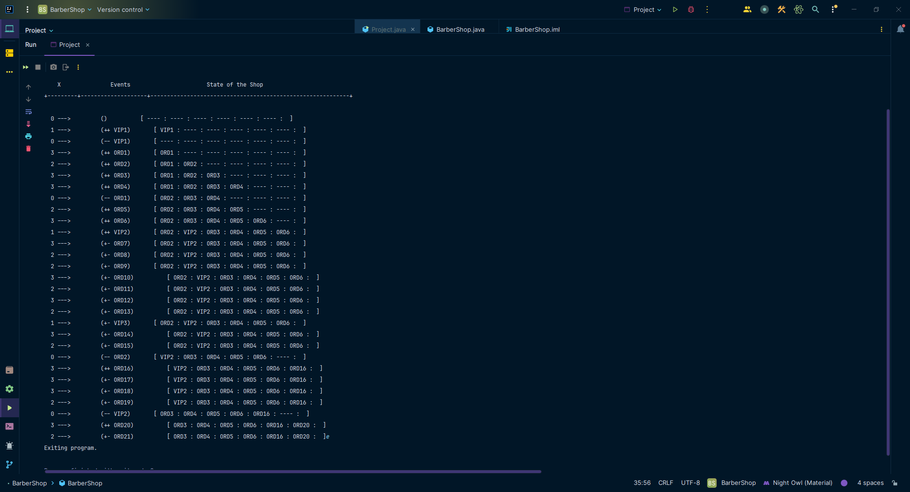

# Executive Barbering Shop Simulation

## Project Overview
This Java program simulates the operations of the "Executive Barbering Shop," where clients arrive to get their hair trimmed, and the shop manages their seating arrangement based on a set of predefined rules. The simulation handles ordinary (ORD) and VIP clients, with VIPs receiving priority seating.

## Features
- Simulates client arrivals and departures.
- Manages a main chair for hair trimming and five waiting chairs.
- Prioritizes VIP clients over ordinary clients.
- Displays the state of the shop after each event.

## Prerequisites
- Java Development Kit (JDK) installed on your machine.

## Setup
1. Clone the repository to your local machine.
2. Navigate to the directory containing the project files.

## Running the Simulation
1. Compile the Java program:
java BarberShop.java
2. Run the compiled program:
java BarberShop
3. Press the space key to trigger random events in the simulation.
4. To exit the simulation, press any key other than the space key.

## Simulation Rules
- If the main chair is empty, the arriving client sits there.
- If the main chair is occupied, clients sit in waiting chairs based on arrival order.
- VIP clients take the first waiting chair, causing others to shift backward.
- VIP client sits next to the last VIP clients if there is any.
- Clients leave the shop if all chairs are occupied.

## Events
- x = 0, (--ClientName) means barber is done trimming the hair of the current client
- x = 1, (++VIP) means the arrival of a VIP client
- x = 2 or x = 3, (++ORD) means the arrival of an ORD client
- (+- ClientName) meaning client didn't get a seat

## Contributing
Contributions to the project are welcome. Please follow the standard Git flow for contributions:
1. Fork the repository.
2. Create a feature branch.
3. Commit your changes.
4. Push to the branch.
5. Open a pull request.

